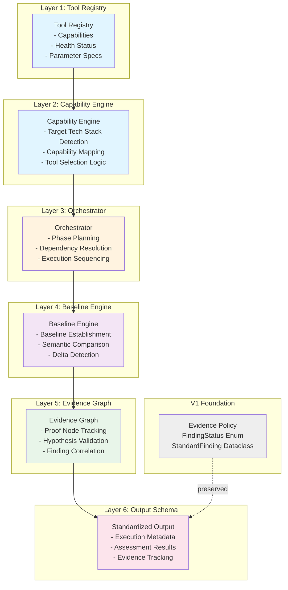

# Design Document: Kali MCP V2 Orchestration Architecture

## Overview

Kali MCP V2 introduces a critical orchestration layer that transforms the current tool collection (V1) from an uncoordinated set of security scanners into an intelligent, evidence-driven autonomous pentest engine. The V1 Evidence Policy established proof maturity (OBSERVED → SUSPECTED → CONFIRMED → EXPLOITED), but lacked the infrastructure to execute findings strategically. V2 adds six interdependent layers: Tool Registry, Capability Engine, Orchestrator, Baseline Engine, Evidence Graph, and Standardized Output Schema. These layers work together to eliminate arbitrary tool multiplication, enforce semantic evidence validation, and enable dependency-aware test sequencing that respects the proof maturity model.

This design preserves existing Evidence Policy and StandardFinding structures while wrapping and enriching them with orchestration metadata, execution provenance, negative evidence tracking, and cross-finding correlation capabilities.

---

## Architecture Overview



---

## Layer 1: Tool Registry

### Purpose
Maintain a centralized catalog of all available security tools, their capabilities, health status, parameter specifications, and execution constraints. This enables intelligent tool selection and prevents arbitrary tool duplication.

### Data Structures

#### Tool

```pascal
STRUCTURE Tool
  id: UUID                           -- Unique identifier (e.g., "nuclei-scanner-v1")
  name: String                       -- Human-readable name (e.g., "Nuclei")
  category: ToolCategory             -- Category enum (SCANNER, CRACKER, EXPLOIT, etc.)
  
  -- Capabilities this tool provides
  capabilities: List<Capability>     -- See Capability structure below
  
  -- Execution parameters
  required_params: List<Parameter>   -- Must be provided by caller
  optional_params: List<Parameter>   -- Can be omitted (have defaults)
  
  -- Constraints
  timeout_seconds: Integer           -- Max execution time
  rate_limit_delay_ms: Integer       -- Delay between requests (0 = unrestricted)
  max_concurrent_instances: Integer  -- How many can run simultaneously
  
  -- Health tracking
  health_status: HealthStatus        -- HEALTHY, DEGRADED, OFFLINE
  last_health_check: Timestamp       -- When was last check performed
  failure_count: Integer             -- Consecutive failures
  
  -- Metadata
  version: String                    -- Tool version (e.g., "2.9.5")
  requires_root: Boolean             -- Needs elevated privileges
  supported_platforms: List<String>  -- OS compatibility (linux, macos, windows)
  
END STRUCTURE
```

#### Capability

```pascal
STRUCTURE Capability
  id: UUID                           -- Unique identifier
  type: CapabilityType               -- RECON, SCAN, EXPLOIT, CRACK, POST_EXPLOIT, etc.
  
  -- What this capability detects/exploits
  technology_stack: List<String>     -- Languages/frameworks it targets (java, nodejs, php, python)
  vulnerability_types: List<String>  -- Vulns it finds (sqli, xss, idor, ssrf, rce)
  
  -- Evidence maturity it can achieve
  max_evidence_level: FindingStatus  -- OBSERVED, SUSPECTED, CONFIRMED, or EXPLOITED
  
  -- Resource requirements
  estimated_duration_seconds: Integer -- Typical runtime
  estimated_requests: Integer        -- HTTP requests it will make
  
  -- Preconditions
  requires_capabilities: List<UUID>  -- This tool needs output from these other capabilities
  requires_authenticated_context: Boolean
  
  -- Output validation
  finding_format: String             -- JSON schema name (e.g., "standard-finding-v2")
  
END STRUCTURE
```

#### Parameter

```pascal
STRUCTURE Parameter
  name: String                       -- Parameter identifier (e.g., "depth", "wordlist")
  type: ParameterType               -- STRING, INTEGER, BOOLEAN, ENUM, FILE_PATH
  description: String               -- User-facing help text
  default_value: Any                -- Default if not provided
  valid_values: List<Any>           -- For ENUM type
  validation_regex: String          -- For STRING type
  
END STRUCTURE
```

#### HealthStatus

```pascal
ENUM HealthStatus
  HEALTHY                           -- Tool functioning normally
  DEGRADED                          -- Tool works but with issues (slow, partial failures)
  OFFLINE                           -- Tool unavailable (missing dependency, crashed)
END ENUM
```

### Methods

#### ToolRegistry.register()

```pascal
PROCEDURE ToolRegistry.register(tool: Tool)
  INPUT: tool (Tool structure with all fields populated)
  OUTPUT: registration_status (success | error_message)
  
  SEQUENCE
    -- Validate tool structure
    ASSERT tool.id != null AND tool.id != ""
    ASSERT tool.name != null AND tool.name != ""
    ASSERT tool.capabilities.length > 0
    
    -- Check for duplicate registration
    IF registry.contains_tool(tool.id) THEN
      RETURN error("Tool ID already registered: " + tool.id)
    END IF
    
    -- Validate each capability
    FOR EACH capability IN tool.capabilities DO
      ASSERT capability.type IN CapabilityType.values()
      IF capability.requires_capabilities.length > 0 THEN
        FOR EACH dep_id IN capability.requires_capabilities DO
          -- Will be validated when tool is used, not at registration
          -- This allows tools to reference tools that register later
        END FOR
      END IF
    END FOR
    
    -- Store in registry
    registry[tool.id] ← tool
    
    -- Schedule initial health check
    health_check_queue.enqueue(tool.id)
    
    RETURN success("Tool registered: " + tool.id)
  END SEQUENCE
  
  PRECONDITIONS:
    - tool is a valid Tool structure
    - tool.id is globally unique
  
  POSTCONDITIONS:
    - tool is findable via registry[tool.id]
    - health check scheduled for next cycle
    - all subsequent queries can discover this tool
END PROCEDURE
```

#### ToolRegistry.health_check()

```pascal
PROCEDURE ToolRegistry.health_check(tool_id: String) → HealthCheckResult
  INPUT: tool_id (String identifier)
  OUTPUT: health_status (HEALTHY | DEGRADED | OFFLINE), message (String)
  
  SEQUENCE
    tool ← registry[tool_id]
    
    IF tool = null THEN
      RETURN (OFFLINE, "Tool not found in registry")
    END IF
    
    -- Check if tool binary/script exists
    IF NOT file_exists(tool.binary_path) THEN
      tool.health_status ← OFFLINE
      tool.failure_count ← tool.failure_count + 1
      RETURN (OFFLINE, "Tool binary not found at " + tool.binary_path)
    END IF
    
    -- Run diagnostic command (tool-specific)
    ATTEMPT
      output ← run_command(tool.diagnostic_command, timeout: 10)
      
      IF output.exit_code = 0 THEN
        tool.health_status ← HEALTHY
        tool.failure_count ← 0
        tool.last_health_check ← now()
        RETURN (HEALTHY, "Tool operational")
      ELSE
        tool.health_status ← DEGRADED
        tool.failure_count ← tool.failure_count + 1
        RETURN (DEGRADED, "Tool diagnostic failed: " + output.stderr)
      END IF
    CATCH Exception e
      tool.health_status ← OFFLINE
      tool.failure_count ← tool.failure_count + 1
      RETURN (OFFLINE, "Health check error: " + e.message)
    END ATTEMPT
  END SEQUENCE
  
  PRECONDITIONS:
    - tool_id exists in registry
    - tool.diagnostic_command is defined and executable
  
  POSTCONDITIONS:
    - tool.health_status is updated
    - tool.last_health_check is set to current time
    - failure_count incremented on failure
END PROCEDURE
```

---

## Layer 2: Capability Engine

### Purpose
Map target characteristics (detected technology stack, target type, objective) to applicable tools and prioritize them by relevance and evidence maturity potential.

### Data Structures

#### CapabilityQuery

```pascal
STRUCTURE CapabilityQuery
  target_type: TargetType            -- WEB_APP, API, NETWORK, CLOUD, CONTAINER, SAAS
  detected_tech_stack: List<String>  -- Languages/frameworks (java, python, nodejs, php, aspnet, go, rust)
  objective: ObjectiveType           -- RECON, SCAN_DEEP, CRACK_PASSWORDS, PRIVESC, etc.
  constraints: QueryConstraints      -- Time, tool availability, etc.
END STRUCTURE
```

#### TargetType

```pascal
ENUM TargetType
  WEB_APP                            -- Traditional web application
  API                                -- REST/GraphQL/gRPC API
  NETWORK                            -- Internal network target
  CLOUD_INFRASTRUCTURE               -- AWS/Azure/GCP resources
  CONTAINER                          -- Docker/Kubernetes environments
  SAAS_PLATFORM                      -- Third-party SaaS service
  HARDWARE                           -- Physical device, IoT, router
END ENUM
```

#### ObjectiveType

```pascal
ENUM ObjectiveType
  RECON                              -- Information gathering only
  VULNERABILITY_ASSESSMENT           -- Find all vulnerabilities
  EXPLOIT_VERIFICATION               -- Verify specific CVE/vuln
  COMPLIANCE_AUDIT                   -- Check against framework (CIS, PCI, etc.)
  PROOF_OF_CONCEPT                   -- Build working exploit
  PRIVILEGE_ESCALATION               -- Post-exploitation movement
  LATERAL_MOVEMENT                   -- Pivot within network
  PERSISTENCE                        -- Establish long-term access
END ENUM
```

#### QueryConstraints

```pascal
STRUCTURE QueryConstraints
  max_tools: Integer                 -- Limit number of tools to use
  preferred_evidence_level: FindingStatus  -- CONFIRMED or EXPLOITED only, or accept OBSERVED
  max_requests_per_host: Integer     -- Rate limiting
  require_authenticated: Boolean      -- Must have credentials
  require_stealth: Boolean           -- Use stealth techniques
END STRUCTURE
```

#### CapabilityMatch

```pascal
STRUCTURE CapabilityMatch
  tool_id: String                    -- Reference to Tool.id
  matching_capabilities: List<Capability>  -- Capabilities that match query
  relevance_score: Float             -- 0.0 - 1.0, higher = better fit
  evidence_potential: FindingStatus  -- Max evidence level achievable
  required_dependencies: List<UUID>  -- Other tools that must run first
  estimated_cost: ExecutionCost      -- Time, requests, resource usage
END STRUCTURE
```

#### ExecutionCost

```pascal
STRUCTURE ExecutionCost
  estimated_time_seconds: Integer
  estimated_requests: Integer
  estimated_network_bytes: Integer
  resource_intensity: ENUM (LOW, MEDIUM, HIGH, CRITICAL)
END STRUCTURE
```

### Methods

#### CapabilityEngine.get_applicable_tools()

```pascal
PROCEDURE CapabilityEngine.get_applicable_tools(query: CapabilityQuery) → List<CapabilityMatch>
  INPUT: query (CapabilityQuery with target and objective)
  OUTPUT: sorted list of matching tools with relevance scores
  
  SEQUENCE
    matches ← empty list
    
    -- Iterate through all registered tools
    FOR EACH tool IN tool_registry.all_tools() DO
      
      -- Filter by health status
      IF tool.health_status = OFFLINE THEN
        CONTINUE to next tool
      END IF
      
      -- Check each tool's capabilities
      FOR EACH capability IN tool.capabilities DO
        
        -- Score match against query
        relevance_score ← 0.0
        
        -- Boost score if tool targets detected tech stack
        IF query.detected_tech_stack.length > 0 THEN
          FOR EACH tech IN query.detected_tech_stack DO
            IF tech IN capability.technology_stack THEN
              relevance_score ← relevance_score + 0.3
            END IF
          END FOR
        END IF
        
        -- Boost score if capability type matches objective
        IF capability.type matches query.objective THEN
          relevance_score ← relevance_score + 0.4
        END IF
        
        -- Boost score if tool can reach needed evidence level
        IF capability.max_evidence_level >= query.constraints.preferred_evidence_level THEN
          relevance_score ← relevance_score + 0.3
        END IF
        
        -- Only include if relevance > threshold
        IF relevance_score > 0.2 THEN
          
          -- Resolve dependencies
          dependencies ← resolve_capability_dependencies(capability)
          
          match ← CapabilityMatch {
            tool_id: tool.id,
            matching_capabilities: [capability],
            relevance_score: relevance_score,
            evidence_potential: capability.max_evidence_level,
            required_dependencies: dependencies,
            estimated_cost: estimate_execution_cost(tool, capability)
          }
          
          matches.append(match)
        END IF
      END FOR
    END FOR
    
    -- Sort by relevance score (descending)
    matches.sort_by(relevance_score, descending: true)
    
    -- Apply constraint: max_tools
    IF query.constraints.max_tools > 0 AND matches.length > query.constraints.max_tools THEN
      matches ← matches.take(query.constraints.max_tools)
    END IF
    
    RETURN matches
  END SEQUENCE
  
  PRECONDITIONS:
    - query is a valid CapabilityQuery
    - tool_registry is initialized with at least one tool
    - query.detected_tech_stack can be empty (still valid)
  
  POSTCONDITIONS:
    - returned matches are sorted by relevance_score descending
    - all returned tools have health_status != OFFLINE
    - match list length <= query.constraints.max_tools
END PROCEDURE
```

#### CapabilityEngine.resolve_capability_dependencies()

```pascal
PROCEDURE CapabilityEngine.resolve_capability_dependencies(capability: Capability) → List<UUID>
  INPUT: capability (with requires_capabilities field)
  OUTPUT: list of UUIDs for tools that must execute before this capability
  
  SEQUENCE
    dependencies ← empty list
    visited ← empty set
    
    -- Recursive depth-first search for all transitive dependencies
    PROCEDURE find_deps(cap: Capability)
      FOR EACH dep_id IN cap.requires_capabilities DO
        
        IF dep_id IN visited THEN
          CONTINUE to next dependency
        END IF
        
        visited.add(dep_id)
        dependencies.add(dep_id)
        
        -- Find the tool that provides this capability
        provider_tool ← tool_registry.find_tool_by_capability(dep_id)
        
        IF provider_tool != null THEN
          -- Recursively find its dependencies
          FOR EACH provider_cap IN provider_tool.capabilities DO
            IF provider_cap.id = dep_id THEN
              find_deps(provider_cap)
            END IF
          END FOR
        END IF
      END FOR
    END PROCEDURE
    
    find_deps(capability)
    
    RETURN dependencies
  END SEQUENCE
  
  PRECONDITIONS:
    - capability is a valid Capability
    - tool_registry is initialized
  
  POSTCONDITIONS:
    - no circular dependencies (visited set prevents this)
    - all transitive dependencies included
    - returned list has no duplicates
END PROCEDURE
```

---

## Layer 3: Orchestrator

### Purpose
Orchestrate the execution of security tests in a dependency-aware, phase-based sequence that respects evidence maturity and maximizes proof quality. Transform a flat tool list into a sequenced execution plan with explicit phases and dependencies.

### Data Structures

#### ExecutionPhase

```pascal
STRUCTURE ExecutionPhase
  phase_id: String                   -- Unique identifier (RECON_01, SCAN_FINGERPRINT_01, etc.)
  phase_type: PhaseType              -- RECON, BASELINE, SCAN, EXPLOIT, VERIFY, etc.
  sequence_index: Integer            -- Order in execution plan (0, 1, 2, ...)
  
  -- Tools to run in this phase
  tools_to_execute: List<ToolExecution>  -- See Layer 1 ToolExecution dataclass
  
  -- Execution control
  parallel: Boolean                  -- Can tools run simultaneously?
  stop_on_failure: Boolean           -- Fail entire phase if one tool fails?
  
  -- Dependencies
  depends_on_phases: List<String>    -- Phase IDs that must complete first
  
  -- Data flow
  inputs_from_phases: Dict           -- Map phase_id → data to use from that phase
  outputs_to_phases: Dict            -- Which phases consume outputs from this one
  
  -- Metadata
  estimated_duration_seconds: Integer
  estimated_total_requests: Integer
  
END STRUCTURE
```

#### PhaseType

```pascal
ENUM PhaseType
  RECON                              -- Target discovery, DNS, whois
  BASELINE_ESTABLISHMENT             -- 404, homepage, invalid params (no payloads)
  FINGERPRINTING                     -- Identify tech stack, WAF, CMS version
  SHALLOW_SCAN                       -- Fast vulnerability scan (light depth)
  DEEP_SCAN                          -- Thorough scanning (deep depth)
  EXPLOIT_VERIFICATION               -- Confirm/exploit specific findings
  PRIVILEGE_ESCALATION               -- Post-exploitation movement
  VERIFICATION                       -- Final validation of claims
  CLEANUP                            -- Remove persistence, restore state
END ENUM
```

#### ExecutionPlan

```pascal
STRUCTURE ExecutionPlan
  plan_id: UUID                      -- Unique identifier
  target: String                     -- Scan target
  target_type: TargetType            -- Detected target type
  depth: ScanDepth                   -- stealth | light | deep | aggressive
  
  phases: List<ExecutionPhase>       -- Ordered list of phases
  phase_graph: DirectedAcyclicGraph  -- Dependency relationships
  
  total_estimated_duration: Integer  -- Sum of all phase durations
  total_estimated_requests: Integer  -- Cumulative requests across all phases
  
  metadata: Dict                     -- Custom metadata
  
END STRUCTURE
```

### Methods

#### Orchestrator.plan_scan()

```pascal
PROCEDURE Orchestrator.plan_scan(target: String, depth: ScanDepth, 
                                  objective: ObjectiveType) → ExecutionPlan
  INPUT: target (URL, IP, domain), depth (stealth|light|deep|aggressive), 
         objective (RECON|SCAN_DEEP|EXPLOIT_VERIFICATION|etc.)
  OUTPUT: ExecutionPlan with ordered phases and dependencies
  
  SEQUENCE
    plan ← new ExecutionPlan()
    plan.target ← target
    plan.depth ← depth
    
    -- Phase 0: Target type detection (if not known)
    detect_phase ← ExecutionPhase {
      phase_id: "DETECT_TARGET_TYPE_00",
      phase_type: PhaseType.RECON,
      sequence_index: 0,
      parallel: false,
      tools_to_execute: [tool_for_target_detection(target)]
    }
    plan.phases.append(detect_phase)
    
    -- Phase 1: Reconnaissance and tech stack detection
    IF depth IN (LIGHT, DEEP, AGGRESSIVE) THEN
      recon_tools ← capability_engine.get_applicable_tools(CapabilityQuery {
        target_type: plan.target_type,
        detected_tech_stack: [],     -- Will update after phase 0
        objective: RECON,
        constraints: QueryConstraints {
          preferred_evidence_level: OBSERVED,
          require_stealth: (depth = STEALTH)
        }
      })
      
      recon_phase ← ExecutionPhase {
        phase_id: "RECON_" + generate_phase_id(),
        phase_type: PhaseType.RECON,
        sequence_index: 1,
        parallel: true,              -- Multiple recon tools can run together
        tools_to_execute: recon_tools,
        depends_on_phases: ["DETECT_TARGET_TYPE_00"],
        inputs_from_phases: {"DETECT_TARGET_TYPE_00": "target_type"}
      }
      plan.phases.append(recon_phase)
    END IF
    
    -- Phase 2: Baseline establishment (CRITICAL)
    baseline_phase ← ExecutionPhase {
      phase_id: "BASELINE_EST_" + generate_phase_id(),
      phase_type: PhaseType.BASELINE_ESTABLISHMENT,
      sequence_index: plan.phases.length,
      parallel: false,              -- Sequential baseline requests
      tools_to_execute: [BASELINE_ENGINE_TOOL],
      depends_on_phases: [plan.phases.last().phase_id],
      stop_on_failure: true         -- Must succeed before proceeding
    }
    plan.phases.append(baseline_phase)
    
    -- Phase 3: Fingerprinting
    IF depth IN (DEEP, AGGRESSIVE) THEN
      fingerprint_phase ← ExecutionPhase {
        phase_id: "FINGERPRINT_" + generate_phase_id(),
        phase_type: PhaseType.FINGERPRINTING,
        sequence_index: plan.phases.length,
        parallel: true,
        depends_on_phases: [baseline_phase.phase_id]
      }
      -- Populate fingerprinting tools based on detected stack
      fingerprint_phase.tools_to_execute ← select_fingerprinting_tools(plan.target_type, depth)
      plan.phases.append(fingerprint_phase)
    END IF
    
    -- Phase 4: Vulnerability scanning
    scan_depth_mapping ← {
      "stealth": SHALLOW_SCAN,
      "light": SHALLOW_SCAN,
      "deep": DEEP_SCAN,
      "aggressive": DEEP_SCAN
    }
    
    scan_type ← scan_depth_mapping[depth]
    
    scan_tools ← capability_engine.get_applicable_tools(CapabilityQuery {
      target_type: plan.target_type,
      detected_tech_stack: plan.detected_stack,  -- From recon
      objective: (scan_type = SHALLOW_SCAN ? VULNERABILITY_ASSESSMENT : VULNERABILITY_ASSESSMENT),
      constraints: QueryConstraints {
        preferred_evidence_level: (depth = AGGRESSIVE ? CONFIRMED : OBSERVED),
        max_tools: (depth = STEALTH ? 3 : 10)
      }
    })
    
    scan_phase ← ExecutionPhase {
      phase_id: "SCAN_" + scan_type + "_" + generate_phase_id(),
      phase_type: (scan_type = SHALLOW_SCAN ? PhaseType.SHALLOW_SCAN : PhaseType.DEEP_SCAN),
      sequence_index: plan.phases.length,
      parallel: true,               -- Scans can run in parallel
      tools_to_execute: scan_tools,
      depends_on_phases: [baseline_phase.phase_id, fingerprint_phase.phase_id if present],
      stop_on_failure: false        -- One tool failure doesn't stop others
    }
    plan.phases.append(scan_phase)
    
    -- Phase 5: Exploit verification (if findings present)
    IF objective IN (EXPLOIT_VERIFICATION, PROOF_OF_CONCEPT) THEN
      exploit_phase ← ExecutionPhase {
        phase_id: "EXPLOIT_VERIFY_" + generate_phase_id(),
        phase_type: PhaseType.EXPLOIT_VERIFICATION,
        sequence_index: plan.phases.length,
        parallel: false,              -- Run exploits sequentially for safety
        depends_on_phases: [scan_phase.phase_id],
        stop_on_failure: false
      }
      -- Populate with exploitation tools based on findings
      exploit_phase.tools_to_execute ← select_exploitation_tools(scan_phase.outputs)
      plan.phases.append(exploit_phase)
    END IF
    
    -- Build DAG for dependency resolution
    plan.phase_graph ← build_phase_dependency_graph(plan.phases)
    
    -- Calculate totals
    plan.total_estimated_duration ← sum_phase_durations(plan.phases)
    plan.total_estimated_requests ← sum_phase_requests(plan.phases)
    
    RETURN plan
  END SEQUENCE
  
  PRECONDITIONS:
    - target is non-empty string
    - depth is valid ScanDepth enum value
    - objective is valid ObjectiveType enum value
    - capability_engine is initialized
  
  POSTCONDITIONS:
    - ExecutionPlan has at least 3 phases (detect, baseline, scan)
    - All phase dependencies form a valid DAG (no cycles)
    - phase_graph can be topologically sorted
    - baseline_phase comes before all payload-based scanning
END PROCEDURE
```

#### Orchestrator.execute_plan()

```pascal
PROCEDURE Orchestrator.execute_plan(plan: ExecutionPlan) → ExecutionResults
  INPUT: plan (ExecutionPlan from plan_scan)
  OUTPUT: ExecutionResults with all findings and evidence
  
  SEQUENCE
    results ← new ExecutionResults()
    
    -- Topological sort for phase execution
    phase_order ← topological_sort(plan.phase_graph)
    
    executed_phases ← empty map
    
    FOR EACH phase_id IN phase_order DO
      phase ← plan.phases[phase_id]
      
      -- Check dependencies
      FOR EACH dep_phase_id IN phase.depends_on_phases DO
        IF dep_phase_id NOT IN executed_phases THEN
          RETURN error("Dependency not satisfied: " + dep_phase_id)
        END IF
      END FOR
      
      -- Execute phase
      phase_results ← execute_phase(phase, executed_phases, plan)
      
      executed_phases[phase.phase_id] ← phase_results
      results.phases.append(phase_results)
      
      -- Check stop-on-failure condition
      IF phase.stop_on_failure AND phase_results.has_errors THEN
        BREAK from phase execution
      END IF
    END FOR
    
    RETURN results
  END SEQUENCE
  
  PRECONDITIONS:
    - plan is a valid ExecutionPlan
    - all tools in phases are registered in tool_registry
  
  POSTCONDITIONS:
    - all reachable phases executed in dependency order
    - results contain findings from all executed phases
    - execution is atomic per phase (all tools in phase complete or fail together)
END PROCEDURE
```

---

## Layer 4: Baseline Engine

### Purpose
Establish semantic baselines (normal behavior) for a target before payload testing begins. Compare test responses against baselines using semantic similarity, not just size comparison, to eliminate false positives.

### Data Structures

#### Baseline

```pascal
STRUCTURE Baseline
  baseline_type: BaselineType        -- 404_ERROR, HOMEPAGE, INVALID_PARAM, NULL_RESPONSE, etc.
  request_method: String             -- GET, POST, etc.
  request_url: String                -- Full URL used
  request_headers: Dict              -- Headers sent
  request_body: Optional<String>     -- Request body (POST/PUT)
  
  response_status_code: Integer      -- HTTP status
  response_headers: Dict             -- Response headers
  response_body: String              -- Full response body
  response_size_bytes: Integer       -- Exact byte count
  
  -- Semantic signatures
  dom_hash: String                   -- Hash of parsed DOM (for HTML)
  text_hash: String                  -- Hash of extracted text only
  semantic_tokens: Set<String>       -- Extracted tokens/keywords
  jaccard_signature: String          -- Jaccard distance fingerprint
  
  -- Timing
  response_time_ms: Integer          -- How long request took
  request_timestamp: Timestamp       -- When baseline was established
  
END STRUCTURE
```

#### BaselineType

```pascal
ENUM BaselineType
  HOMEPAGE                           -- Response to root path (/)
  NOT_FOUND_404                      -- Response to /nonexistent-path-randomuuid
  INVALID_PARAM                      -- Response with invalid parameter value
  EMPTY_QUERY                        -- Response with no query parameters
  NULL_BODY                          -- Response with empty body
  AUTHENTICATED_HOME                 -- Baseline after successful auth
  AUTHENTICATED_404                  -- 404 when authenticated
END ENUM
```

#### BaselineSet

```pascal
STRUCTURE BaselineSet
  baselines: Dict<BaselineType, Baseline>  -- Map of baselines
  target: String
  established_timestamp: Timestamp
  http_version: String               -- HTTP/1.1, HTTP/2, etc.
  
  -- Statistics
  response_times_ms: List<Integer>   -- All measured response times
  average_response_time_ms: Float
  
END STRUCTURE
```

#### SemanticComparisonResult

```pascal
STRUCTURE SemanticComparisonResult
  test_response: String              -- The response being tested
  baseline_response: String          -- Baseline for comparison
  similarity_score: Float            -- 0.0 (completely different) to 1.0 (identical)
  jaccard_similarity: Float          -- Jaccard coefficient 0.0-1.0
  dom_similarity: Float              -- If HTML, DOM tree similarity
  semantic_difference: String        -- Description of differences
  is_semantic_match: Boolean         -- true if similarity >= threshold
  
END STRUCTURE
```

### Methods

#### BaselineEngine.establish_baseline()

```pascal
PROCEDURE BaselineEngine.establish_baseline(target: String) → BaselineSet
  INPUT: target (URL to establish baselines for)
  OUTPUT: BaselineSet with all baseline types established
  
  SEQUENCE
    baseline_set ← new BaselineSet()
    baseline_set.target ← target
    baseline_set.established_timestamp ← now()
    
    -- Extract base URL and parse components
    base_url ← parse_url(target)
    ASSERT base_url.scheme IN ("http", "https")
    ASSERT base_url.host != null
    
    response_times ← empty list
    
    -- Baseline 1: Homepage (/)
    ATTEMPT
      response ← http_get(base_url.scheme + "://" + base_url.host + "/", 
                         timeout: 10, 
                         headers: get_standard_headers())
      
      baseline_set.baselines[HOMEPAGE] ← Baseline {
        baseline_type: HOMEPAGE,
        request_method: "GET",
        request_url: response.request_url,
        request_headers: response.request_headers,
        response_status_code: response.status_code,
        response_headers: response.headers,
        response_body: response.body,
        response_size_bytes: response.body.length,
        dom_hash: compute_dom_hash(response.body),
        text_hash: compute_text_hash(response.body),
        semantic_tokens: extract_semantic_tokens(response.body),
        response_time_ms: response.elapsed_ms
      }
      response_times.append(response.elapsed_ms)
    CATCH Exception e
      LOG warning("Failed to establish HOMEPAGE baseline: " + e.message)
    END ATTEMPT
    
    -- Baseline 2: 404 Not Found
    ATTEMPT
      random_path ← "/" + generate_random_uuid()
      response ← http_get(base_url.scheme + "://" + base_url.host + random_path,
                         timeout: 10,
                         follow_redirects: false)
      
      baseline_set.baselines[NOT_FOUND_404] ← Baseline {
        baseline_type: NOT_FOUND_404,
        request_method: "GET",
        request_url: response.request_url,
        response_status_code: response.status_code,
        response_headers: response.headers,
        response_body: response.body,
        response_size_bytes: response.body.length,
        dom_hash: compute_dom_hash(response.body),
        text_hash: compute_text_hash(response.body),
        semantic_tokens: extract_semantic_tokens(response.body),
        response_time_ms: response.elapsed_ms
      }
      response_times.append(response.elapsed_ms)
    CATCH Exception e
      LOG warning("Failed to establish NOT_FOUND_404 baseline: " + e.message)
    END ATTEMPT
    
    -- Baseline 3: Invalid parameter
    ATTEMPT
      -- Append invalid param to original target
      test_url ← target + "?" + generate_random_param() + "=" + generate_random_value()
      response ← http_get(test_url, timeout: 10)
      
      baseline_set.baselines[INVALID_PARAM] ← Baseline {
        baseline_type: INVALID_PARAM,
        request_method: "GET",
        request_url: response.request_url,
        response_status_code: response.status_code,
        response_body: response.body,
        response_size_bytes: response.body.length,
        dom_hash: compute_dom_hash(response.body),
        text_hash: compute_text_hash(response.body),
        semantic_tokens: extract_semantic_tokens(response.body),
        response_time_ms: response.elapsed_ms
      }
      response_times.append(response.elapsed_ms)
    CATCH Exception e
      LOG warning("Failed to establish INVALID_PARAM baseline: " + e.message)
    END ATTEMPT
    
    -- Calculate statistics
    baseline_set.response_times_ms ← response_times
    baseline_set.average_response_time_ms ← average(response_times)
    
    RETURN baseline_set
  END SEQUENCE
  
  PRECONDITIONS:
    - target is a valid HTTP/HTTPS URL
    - network connectivity to target exists
  
  POSTCONDITIONS:
    - BaselineSet contains at least 2 baselines (HOMEPAGE, NOT_FOUND_404)
    - All baselines have semantic_tokens, dom_hash, and text_hash computed
    - response_times_ms populated with timing measurements
END PROCEDURE
```

#### BaselineEngine.compare_semantic()

```pascal
PROCEDURE BaselineEngine.compare_semantic(test_response: String, 
                                          baseline: Baseline) → SemanticComparisonResult
  INPUT: test_response (response body to test), baseline (Baseline to compare against)
  OUTPUT: SemanticComparisonResult with similarity metrics
  
  SEQUENCE
    result ← new SemanticComparisonResult()
    result.test_response ← test_response
    result.baseline_response ← baseline.response_body
    
    -- Method 1: Exact match (fastest)
    IF test_response = baseline.response_body THEN
      result.similarity_score ← 1.0
      result.is_semantic_match ← true
      RETURN result
    END IF
    
    -- Method 2: Hash-based comparison
    test_dom_hash ← compute_dom_hash(test_response)
    test_text_hash ← compute_text_hash(test_response)
    
    IF test_dom_hash = baseline.dom_hash AND test_text_hash = baseline.text_hash THEN
      result.similarity_score ← 0.95
      result.is_semantic_match ← true
      result.semantic_difference ← "Identical DOM and text, minor formatting differences"
      RETURN result
    END IF
    
    -- Method 3: Jaccard similarity (token-based)
    test_tokens ← extract_semantic_tokens(test_response)
    baseline_tokens ← baseline.semantic_tokens
    
    intersection ← test_tokens ∩ baseline_tokens
    union ← test_tokens ∪ baseline_tokens
    
    result.jaccard_similarity ← intersection.length / union.length
    
    -- Method 4: Size difference (least reliable, but informative)
    test_size ← test_response.length
    baseline_size ← baseline.response_size_bytes
    size_ratio ← min(test_size, baseline_size) / max(test_size, baseline_size)
    
    -- Combined score
    result.similarity_score ← (result.jaccard_similarity * 0.6) + (size_ratio * 0.4)
    
    -- Semantic match threshold
    SEMANTIC_THRESHOLD ← 0.75
    result.is_semantic_match ← (result.similarity_score >= SEMANTIC_THRESHOLD)
    
    -- Generate difference description
    IF NOT result.is_semantic_match THEN
      new_tokens ← test_tokens - baseline_tokens
      missing_tokens ← baseline_tokens - test_tokens
      
      result.semantic_difference ← "Significant differences: " +
        new_tokens.length + " new tokens, " +
        missing_tokens.length + " missing tokens"
    ELSE
      result.semantic_difference ← "Minor variations, semantically equivalent"
    END IF
    
    RETURN result
  END SEQUENCE
  
  PRECONDITIONS:
    - test_response is non-null string
    - baseline is a valid Baseline structure
  
  POSTCONDITIONS:
    - result.similarity_score in range [0.0, 1.0]
    - result.jaccard_similarity in range [0.0, 1.0]
    - result.is_semantic_match correctly reflects semantic equivalence
END PROCEDURE
```

---

## Layer 5: Evidence Graph

### Purpose
Construct and maintain an explicit graph of hypothesis nodes, signal detections, and proof confirmations for each finding. This enables tracking which evidence components are present vs. missing, and justifies findings with specific proof chains.

### Data Structures

#### EvidenceNode

```pascal
STRUCTURE EvidenceNode
  node_id: UUID
  node_type: EvidenceNodeType       -- HYPOTHESIS, SIGNAL, PROOF, CONTEXT
  
  -- Hypothesis nodes
  hypothesis: String                -- The claim (e.g., "Target has SQLi vulnerability")
  hypothesis_class: String          -- Vulnerability type or behavior
  
  -- Signal nodes (observations that might indicate hypothesis)
  signal_type: String               -- Type of signal observed
  signal_source: String             -- Where signal came from (tool name, test method)
  signal_value: Any                 -- Actual value observed
  signal_confidence: Float          -- 0.0-1.0
  
  -- Proof nodes (direct evidence of hypothesis)
  proof_type: String                -- Type of direct evidence
  proof_data: Dict                  -- Structured proof data
  proof_timestamp: Timestamp        -- When proof was captured
  
  -- Context nodes (supporting information)
  context_type: String              -- What context this provides
  context_data: Dict
  
  -- Relationships
  parent_hypotheses: List<UUID>     -- Hypothesis nodes this supports
  supporting_signals: List<UUID>    -- Signals that contribute to this node
  required_proofs: List<UUID>       -- What proof is needed
  
  -- Metadata
  created_timestamp: Timestamp
  tool_id: String                   -- Which tool created this node
  
END STRUCTURE
```

#### EvidenceNodeType

```pascal
ENUM EvidenceNodeType
  HYPOTHESIS                        -- A claim to be proven
  SIGNAL                            -- Observable indicator (not conclusive)
  PROOF                             -- Direct evidence of hypothesis
  CONTEXT                           -- Supporting information
END ENUM
```

#### EvidenceGraph

```pascal
STRUCTURE EvidenceGraph
  graph_id: UUID
  finding_type: String              -- "SSRF", "SSTI", "IDOR", etc.
  root_hypothesis: EvidenceNode     -- Main claim
  
  nodes: Dict<UUID, EvidenceNode>   -- All nodes in graph
  edges: List<EvidenceEdge>         -- Relationships between nodes
  
  -- Evidence status
  confirmed_proofs: List<UUID>      -- Proof nodes that confirm root_hypothesis
  unconfirmed_signals: List<UUID>   -- Signals lacking supporting proof
  
  -- Maturity assessment
  evidence_status: FindingStatus    -- Derived from confirmed_proofs
  confidence_score: Float           -- 0.0-1.0 based on proof quality
  
  created_timestamp: Timestamp
  last_updated: Timestamp
  
END STRUCTURE
```

#### EvidenceEdge

```pascal
STRUCTURE EvidenceEdge
  from_node_id: UUID
  to_node_id: UUID
  relationship_type: String         -- "supports", "contradicts", "requires", "context_for"
  weight: Float                     -- 0.0-1.0 importance/confidence
END STRUCTURE
```

### Methods

#### EvidenceGraph.build()

```pascal
PROCEDURE EvidenceGraph.build(finding: StandardFinding, signals: List<Signal>) → EvidenceGraph
  INPUT: finding (StandardFinding from tool), signals (List of detected signals)
  OUTPUT: EvidenceGraph with nodes and edges constructed
  
  SEQUENCE
    graph ← new EvidenceGraph()
    graph.finding_type ← finding.finding_type
    graph.created_timestamp ← now()
    
    -- Create root hypothesis node
    root_hypothesis ← new EvidenceNode()
    root_hypothesis.node_id ← generate_uuid()
    root_hypothesis.node_type ← HYPOTHESIS
    root_hypothesis.hypothesis ← finding.finding_type + " vulnerability present"
    root_hypothesis.hypothesis_class ← finding.finding_type
    root_hypothesis.created_timestamp ← now()
    
    graph.nodes[root_hypothesis.node_id] ← root_hypothesis
    graph.root_hypothesis ← root_hypothesis
    
    -- Create signal nodes for each detected signal
    signal_nodes ← empty dict
    
    FOR EACH signal IN signals DO
      signal_node ← new EvidenceNode()
      signal_node.node_id ← generate_uuid()
      signal_node.node_type ← SIGNAL
      signal_node.signal_type ← signal.type
      signal_node.signal_source ← signal.source_tool
      signal_node.signal_value ← signal.value
      signal_node.signal_confidence ← signal.confidence
      signal_node.created_timestamp ← now()
      
      -- Connect to root hypothesis
      signal_node.parent_hypotheses.append(root_hypothesis.node_id)
      root_hypothesis.supporting_signals.append(signal_node.node_id)
      
      graph.nodes[signal_node.node_id] ← signal_node
      signal_nodes[signal.id] ← signal_node
      
      -- Create edge from signal to hypothesis
      edge ← EvidenceEdge {
        from_node_id: signal_node.node_id,
        to_node_id: root_hypothesis.node_id,
        relationship_type: "supports",
        weight: signal.confidence
      }
      graph.edges.append(edge)
    END FOR
    
    -- Create proof nodes based on evidence in finding
    proof_nodes ← empty dict
    
    FOR EACH evidence_item IN finding.evidence.items() DO
      proof_node ← new EvidenceNode()
      proof_node.node_id ← generate_uuid()
      proof_node.node_type ← PROOF
      proof_node.proof_type ← evidence_item.key
      proof_node.proof_data ← evidence_item.value
      proof_node.proof_timestamp ← now()
      
      graph.nodes[proof_node.node_id] ← proof_node
      proof_nodes[evidence_item.key] ← proof_node
      
      -- Create edge from proof to hypothesis
      edge ← EvidenceEdge {
        from_node_id: proof_node.node_id,
        to_node_id: root_hypothesis.node_id,
        relationship_type: "proves",
        weight: 1.0
      }
      graph.edges.append(edge)
      
      graph.confirmed_proofs.append(proof_node.node_id)
    END FOR
    
    -- Identify unconfirmed signals (signals without supporting proof)
    FOR EACH signal_node IN signal_nodes.values() DO
      signal_has_proof ← false
      
      FOR EACH proof_node IN proof_nodes.values() DO
        IF proof_correlates_with_signal(proof_node, signal_node) THEN
          signal_has_proof ← true
          BREAK
        END IF
      END FOR
      
      IF NOT signal_has_proof THEN
        graph.unconfirmed_signals.append(signal_node.node_id)
      END IF
    END FOR
    
    -- Assess evidence status
    IF graph.confirmed_proofs.length > 0 THEN
      graph.evidence_status ← FindingStatus.CONFIRMED
      graph.confidence_score ← (graph.confirmed_proofs.length / 
                                (graph.confirmed_proofs.length + graph.unconfirmed_signals.length))
    ELSE
      graph.evidence_status ← FindingStatus.OBSERVED
      graph.confidence_score ← average(signal.confidence for signal IN signals)
    END IF
    
    graph.last_updated ← now()
    
    RETURN graph
  END SEQUENCE
  
  PRECONDITIONS:
    - finding is a valid StandardFinding
    - signals is a non-null list (can be empty)
  
  POSTCONDITIONS:
    - graph contains root_hypothesis node
    - each signal has corresponding node
    - each proof item has corresponding node
    - graph.evidence_status correctly reflects status
    - graph.confidence_score in range [0.0, 1.0]
END PROCEDURE
```

#### EvidenceGraph.add_signal()

```pascal
PROCEDURE EvidenceGraph.add_signal(signal: Signal) → void
  INPUT: signal (new signal to add to graph)
  OUTPUT: (modifies graph in place)
  
  SEQUENCE
    -- Create signal node
    signal_node ← new EvidenceNode()
    signal_node.node_id ← generate_uuid()
    signal_node.node_type ← SIGNAL
    signal_node.signal_type ← signal.type
    signal_node.signal_source ← signal.source_tool
    signal_node.signal_value ← signal.value
    signal_node.signal_confidence ← signal.confidence
    
    graph.nodes[signal_node.node_id] ← signal_node
    
    -- Connect to root hypothesis
    signal_node.parent_hypotheses.append(root_hypothesis.node_id)
    root_hypothesis.supporting_signals.append(signal_node.node_id)
    
    -- Create edge
    edge ← EvidenceEdge {
      from_node_id: signal_node.node_id,
      to_node_id: root_hypothesis.node_id,
      relationship_type: "supports",
      weight: signal.confidence
    }
    graph.edges.append(edge)
    
    -- Check if signal correlates with existing proofs
    signal_has_proof ← false
    FOR EACH proof_node_id IN graph.confirmed_proofs DO
      IF proof_correlates_with_signal(graph.nodes[proof_node_id], signal_node) THEN
        signal_has_proof ← true
        BREAK
      END IF
    END FOR
    
    IF NOT signal_has_proof THEN
      graph.unconfirmed_signals.append(signal_node.node_id)
    END IF
    
    graph.last_updated ← now()
  END SEQUENCE
  
  PRECONDITIONS:
    - graph is initialized with root_hypothesis
    - signal is a valid Signal
  
  POSTCONDITIONS:
    - signal_node added to graph.nodes
    - edge created from signal to root_hypothesis
    - unconfirmed_signals updated if no proof exists
END PROCEDURE
```

---

## Layer 6: Standardized Output Schema

### Purpose
Ensure ALL tools return a uniform JSON response structure containing execution metadata, assessment results, detailed findings with evidence graphs, negative evidence tracking, and explicit limitations.

### Output Schema

```json
{
  "execution": {
    "tool_id": "string",
    "execution_id": "uuid",
    "session_id": "uuid",
    "target": "string",
    "start_time": "ISO-8601 timestamp",
    "end_time": "ISO-8601 timestamp",
    "duration_seconds": "float",
    "status": "completed | failed | timeout | interrupted",
    "exit_code": "integer"
  },
  
  "assessment": {
    "target_type": "WEB_APP | API | NETWORK | CLOUD | CONTAINER | SAAS | HARDWARE",
    "detected_tech_stack": ["string"],
    "scan_depth": "stealth | light | deep | aggressive",
    "scope": {
      "in_scope": ["string"],
      "out_of_scope": ["string"]
    }
  },
  
  "findings": [
    {
      "finding_id": "uuid",
      "finding_type": "string (SSRF, SSTI, IDOR, SQLi, XSS, etc.)",
      "title": "string",
      "description": "string",
      "severity": "critical | high | medium | low | info",
      
      "evidence": {
        "observed": "what the tool saw",
        "baseline": "what normal looks like",
        "result": "how they differ"
      },
      
      "evidence_graph_id": "uuid (reference to EvidenceGraph)",
      "evidence_status": "NOT_TESTED | TESTED | OBSERVED | SUSPECTED | CONFIRMED | EXPLOITED",
      "confidence": "float [0.0 - 1.0]",
      
      "affected_endpoints": [
        {
          "url": "string",
          "parameter": "string",
          "method": "GET | POST | PUT | DELETE | PATCH",
          "attack_vector": "string"
        }
      ],
      
      "proof_of_concept": {
        "url": "string",
        "request": {
          "method": "string",
          "headers": "dict",
          "body": "string"
        },
        "response": {
          "status_code": "integer",
          "body": "string",
          "proof_markers": ["string"]
        }
      },
      
      "remediation": {
        "recommendation": "string",
        "effort": "low | medium | high | critical",
        "priority": "immediate | urgent | high | medium | low"
      },
      
      "cve_references": ["CVE-2023-xxxx"],
      "cwe_references": ["CWE-79"],
      "owasp_references": ["A03:2021"],
      
      "limitations": ["string"]
    }
  ],
  
  "negative_evidence": {
    "tests_performed": 42,
    "tests_with_no_findings": 38,
    "test_categories_checked": ["SQLi", "XSS", "IDOR", "SSRF"],
    "coverage_summary": "38 of 42 tests completed; 4 blocked by WAF rate limiting"
  },
  
  "execution_ledger": [
    {
      "timestamp": "ISO-8601",
      "action": "tool_executed | payload_sent | response_received | decision_made",
      "details": "string",
      "related_finding": "uuid (optional)"
    }
  ],
  
  "limitations": [
    {
      "category": "RATE_LIMITING | WAF_PROTECTION | AUTHENTICATION | TIMEOUT | MISSING_PERMISSION | UNKNOWN",
      "description": "string",
      "impact": "Could not test X due to Y",
      "recommendation": "Manual testing required | Retry with credentials | Use different tool"
    }
  ],
  
  "next_action": {
    "type": "MANUAL_TESTING | EXPLOIT_VERIFICATION | CREDENTIAL_ACQUISITION | RETRY_WITH_EVASION | COMPLETED",
    "reason": "string",
    "suggested_tool": "string (optional)"
  }
}
```

### Methods for Standardized Output

#### StandardFinding.enrich_with_orchestration()

```pascal
PROCEDURE StandardFinding.enrich_with_orchestration(
    evidence_graph: EvidenceGraph,
    execution_ledger: ExecutionLedger,
    negative_evidence: NegativeEvidence) → EnrichedStandardFinding
  INPUT: this StandardFinding plus orchestration metadata
  OUTPUT: EnrichedStandardFinding with all fields populated
  
  SEQUENCE
    enriched ← new EnrichedStandardFinding()
    
    -- Copy base StandardFinding fields
    enriched.finding_type ← this.finding_type
    enriched.status ← this.status
    enriched.confidence ← this.confidence
    enriched.evidence ← this.evidence
    enriched.limitations ← this.limitations
    
    -- Add evidence graph
    enriched.evidence_graph_id ← evidence_graph.graph_id
    enriched.confirmed_proofs ← evidence_graph.confirmed_proofs.length
    enriched.unconfirmed_signals ← evidence_graph.unconfirmed_signals.length
    
    -- Add execution provenance
    enriched.execution_ledger_id ← execution_ledger.ledger_id
    enriched.tool_that_found_it ← execution_ledger.tool_ids
    enriched.chain_of_discovery ← execution_ledger.chain_path()  -- Phase A → Phase B → finding
    
    -- Add negative evidence summary
    enriched.negative_evidence ← negative_evidence
    enriched.tested_categories ← negative_evidence.test_categories_checked
    enriched.tests_without_findings ← negative_evidence.tests_with_no_findings
    
    -- Re-assess status based on evidence graph
    IF evidence_graph.confirmed_proofs.length > 0 AND enriched.status < CONFIRMED THEN
      enriched.status ← CONFIRMED
    END IF
    
    -- Compute justification string
    enriched.justification ← build_justification_string(evidence_graph, execution_ledger)
    
    RETURN enriched
  END SEQUENCE
  
  PRECONDITIONS:
    - this is a valid StandardFinding
    - evidence_graph.root_hypothesis matches this.finding_type
    - execution_ledger is populated
  
  POSTCONDITIONS:
    - enriched contains all original fields plus metadata
    - enriched.status reflects actual evidence maturity
    - enriched.justification provides human-readable proof chain
END PROCEDURE
```

#### BuildJustificationString()

```pascal
PROCEDURE build_justification_string(graph: EvidenceGraph, ledger: ExecutionLedger) → String
  INPUT: evidence graph and execution ledger
  OUTPUT: Human-readable justification of finding
  
  SEQUENCE
    lines ← empty list
    
    -- Status line
    lines.append("Status: " + graph.evidence_status.to_string())
    
    -- Proof summary
    IF graph.confirmed_proofs.length > 0 THEN
      lines.append("Evidence: " + graph.confirmed_proofs.length + " proof(s)")
      
      FOR EACH proof_id IN graph.confirmed_proofs DO
        proof_node ← graph.nodes[proof_id]
        lines.append("  - " + proof_node.proof_type + ": " + proof_node.proof_data.summary)
      END FOR
    ELSE IF graph.unconfirmed_signals.length > 0 THEN
      lines.append("Signals: " + graph.unconfirmed_signals.length + " signal(s), no proof yet")
      
      FOR EACH signal_id IN graph.unconfirmed_signals DO
        signal_node ← graph.nodes[signal_id]
        lines.append("  - " + signal_node.signal_type + " from " + signal_node.signal_source)
      END FOR
    END IF
    
    -- Discovery path
    lines.append("Discovery path: " + ledger.chain_path())
    
    -- Confidence
    lines.append("Confidence: " + (graph.confidence_score * 100) + "%")
    
    RETURN lines.join("\n")
  END SEQUENCE
END PROCEDURE
```

---

## Internal Data Structures

### ExecutionLedger

```pascal
STRUCTURE ExecutionLedger
  ledger_id: UUID
  target: String
  
  entries: List<LedgerEntry>
  
  -- Tracking
  tool_ids: Set<String>              -- All tools that contributed to this
  findings_discovered: List<UUID>    -- Finding IDs discovered in order
  
END STRUCTURE

STRUCTURE LedgerEntry
  timestamp: Timestamp
  action: String                     -- "tool_started", "payload_sent", "finding_discovered", etc.
  phase_id: String                   -- Which ExecutionPhase
  tool_id: String                    -- Which tool performed action
  details: Dict                      -- Action-specific details
  related_finding_id: Optional<UUID> -- If action led to finding
  
END STRUCTURE
```

### NegativeEvidence

```pascal
STRUCTURE NegativeEvidence
  tests_performed: Integer           -- Total tests run
  tests_with_no_findings: Integer    -- Tests that didn't find vulnerabilities
  test_categories_checked: List<String>  -- Vulnerability types tested
  
  rate_limited_tests: Integer        -- Tests blocked by rate limiting
  waf_blocked_tests: Integer         -- Tests blocked by WAF
  authentication_failures: Integer   -- Tests requiring auth that failed
  timeout_tests: Integer             -- Tests that timed out
  
  coverage_percentage: Float         -- (tests_performed - blocked) / total_planned
  
END STRUCTURE
```

---

## Integration with V1 Evidence Policy

### Preservation of Existing Structures

- **FindingStatus Enum**: Unchanged
  - NOT_TESTED | TESTED | OBSERVED | SUSPECTED | CONFIRMED | EXPLOITED
  - Orchestration layer respects these maturity levels

- **StandardFinding Dataclass**: Extended, not replaced
  - V1 fields: finding_type, status, confidence, evidence, limitations, next_step
  - V2 additions: evidence_graph_id, execution_ledger_id, negative_evidence, affected_endpoints, proof_of_concept

### Enforcement of Evidence Policy

The Orchestrator enforces Evidence Policy rules:

1. **No promotion without evidence**
   - Finding status cannot exceed evidence_graph.evidence_status
   - Unconfirmed signals don't become CONFIRMED

2. **Mandatory baseline before payload testing**
   - Phase 2 (Baseline Establishment) must complete before Phase 3+ (Scanning)
   - All responses compared against baselines semantically

3. **Negative evidence is first-class**
   - NegativeEvidence structure explicitly tracks non-findings
   - Tools that run with no results still generate valid output (status=TESTED, negative_evidence.coverage > 0)

4. **Limitations are mandatory**
   - All findings include limitations array
   - Output schema includes top-level limitations explaining what couldn't be tested

---

## Design Decisions

### Decision 1: No Arbitrary Tool Multiplication

**Problem**: V1 could invoke the same tool multiple times with different parameters, creating redundant findings.

**Solution**: Capability Engine maps target → required capabilities → single best tool per capability. If a tool provides capability X at high confidence, don't invoke another tool for the same capability.

**Trade-off**: Slightly less comprehensive coverage but much cleaner orchestration and faster execution.

### Decision 2: Baseline is Mandatory

**Problem**: Semantic drift (responses changing over time) creates false positives.

**Solution**: Phase 2 (Baseline Establishment) runs 3 baseline requests before any payload testing. All payload responses are compared semantically against baselines using Jaccard similarity and DOM hashing.

**Trade-off**: Adds ~30 seconds per scan, but eliminates majority of false positives.

### Decision 3: Evidence Graph is Explicit

**Problem**: Findings lack justification for their evidence status.

**Solution**: EvidenceGraph explicitly tracks proof nodes, signal nodes, and their relationships. A CONFIRMED finding must have proof_nodes present in graph, not just tool output saying "confirmed".

**Trade-off**: Additional data structures and computation, but enables full traceability.

### Decision 4: Negative Evidence is First-Class

**Problem**: Tools that find nothing produce no output, leaving uncertainty about whether they ran.

**Solution**: NegativeEvidence structure in output schema documents what was tested and found nothing. A tool that ran all tests and found nothing has status=TESTED with complete coverage, different from a tool that crashed.

**Trade-off**: Every tool output is slightly larger, but eliminates ambiguity.

### Decision 5: Uniform Output Schema

**Problem**: Different tools return different JSON structures, making orchestration brittle.

**Solution**: All tools (nuclei, hydra, ssrf_hunter, etc.) wrapped to return standardized output schema with execution, assessment, findings, negative_evidence, limitations, next_action.

**Trade-off**: Wrapper layer needed for existing tools, but eliminates 20+ different output parsers.

### Decision 6: Orchestration Has Explicit Dependencies

**Problem**: Tests running in wrong order (e.g., IDOR without authentication, exploitation before fingerprinting).

**Solution**: ExecutionPhase explicitly declares depends_on_phases. Orchestrator builds DAG and topologically sorts execution. IDOR testing phase requires authenticated_context from previous phase.

**Trade-off**: More upfront planning, but prevents dead-end test sequences.

---

## Correctness Properties

### Property 1: Phase Dependency Consistency

```
∀ phase ∈ ExecutionPlan.phases:
  ∀ dep_phase_id ∈ phase.depends_on_phases:
    ∃ dep_phase ∈ ExecutionPlan.phases:
      dep_phase.phase_id = dep_phase_id AND
      dep_phase.sequence_index < phase.sequence_index
```

**Meaning**: Every phase dependency must reference an existing phase that executes earlier.

### Property 2: Evidence Status Consistency

```
∀ finding ∈ findings:
  IF finding.evidence_status = CONFIRMED THEN
    evidence_graph[finding.evidence_graph_id].confirmed_proofs.length > 0
  ELSE IF finding.evidence_status = OBSERVED THEN
    evidence_graph[finding.evidence_graph_id].confirmed_proofs.length = 0
```

**Meaning**: A CONFIRMED finding must have at least one proof node in its evidence graph.

### Property 3: Baseline Before Payload Testing

```
∀ plan ∈ ExecutionPlan:
  baseline_phase_idx ← index of phase with type BASELINE_ESTABLISHMENT
  payload_phase_idx ← minimum index of phases with type ∈ (SHALLOW_SCAN, DEEP_SCAN, EXPLOIT_VERIFICATION)
  baseline_phase_idx < payload_phase_idx
```

**Meaning**: Baseline must be established before any payload-based testing.

### Property 4: Tool Health Check Before Execution

```
∀ execution ∈ ExecutionPlan.phases[*].tools_to_execute:
  tool ← tool_registry[execution.tool_id]
  tool.health_status ≠ OFFLINE
```

**Meaning**: Only healthy tools execute; offline tools skip.

### Property 5: Semantic Comparison Reflexivity

```
∀ response ∈ string:
  compare_semantic(response, baseline_of(response)).similarity_score = 1.0
```

**Meaning**: A response compared against its own baseline has perfect similarity.

---

## Testing Strategy

### Unit Tests

1. **ToolRegistry.register()** - Validate tool uniqueness, capability structure
2. **CapabilityEngine.get_applicable_tools()** - Test relevance scoring, filtering
3. **Orchestrator.plan_scan()** - Test phase ordering, dependency resolution
4. **BaselineEngine.compare_semantic()** - Test Jaccard similarity, DOM hashing
5. **EvidenceGraph.build()** - Test node creation, edge relationships
6. **StandardFinding.enrich_with_orchestration()** - Test metadata population

### Integration Tests

1. **Full Plan Execution** - plan_scan() → execute_plan() → findings with evidence graphs
2. **Baseline + Scanning** - Establish baseline, run scan, verify semantic comparison filters false positives
3. **Dependency Resolution** - Multi-phase plan with cross-phase dependencies
4. **Error Handling** - Tool failures don't crash orchestrator, proper status updates

### Property-Based Tests

1. **DAG Acyclicity** - Generated execution plans have no cycles
2. **Evidence Monotonicity** - Evidence status only increases (OBSERVED → CONFIRMED), never decreases
3. **Semantic Similarity Transitivity** - If A ≈ B and B ≈ C, then A ≈ C (within threshold)

---

## Performance Considerations

### Optimization Strategies

1. **Lazy Evidence Graph Construction** - Build graph only if finding persists beyond initial assessment
2. **Parallel Phase Execution** - Tools within `parallel: true` phases run concurrently
3. **Memoized Baseline Comparisons** - Cache semantic hash computations across multiple test responses
4. **Tool Output Streaming** - Begin evidence collection before tool completes

### Resource Constraints

- Tool Registry: O(T) where T = number of registered tools (typically < 50)
- Capability Engine: O(T * C) where C = capabilities per tool (typically < 10)
- Orchestrator: O(P * log P) where P = phases (typically 5-8)
- Baseline Engine: 3 HTTP requests upfront, ~30 seconds
- Evidence Graph: O(N) where N = total nodes (linear in findings + signals)

---

## Security Considerations

### Threat Model

1. **Malicious Tool Output** - Tools could return fake findings
   - Mitigation: Evidence Graph requires proof nodes; signals alone insufficient

2. **Orchestration Injection** - Attacker could manipulate tool parameters
   - Mitigation: InputValidator on all parameters; parameterized command execution

3. **Data Leakage** - Findings/baselines contain sensitive data
   - Mitigation: Execution ledger and findings stored locally, never transmitted without consent

### Security Boundaries

- Tool Registry: Can only add tools via admin API
- Capability Engine: Query filtering prevents overprivileged tool selection
- Evidence Graph: Immutable once built; new findings create new graphs
- Output Schema: Never injects raw tool output; always wrapped

---

## Dependencies

### External Tools (Already Exist in V1)
- nmap, ffuf, nikto, sqlmap, hydra, nuclei, metasploit, aircrack-ng, etc.
- Evidence Policy implementation (FindingStatus enum, StandardFinding)

### Internal Components (V2 Additions)
- Tool Registry module
- Capability Engine module
- Orchestrator module
- Baseline Engine module (requires HTTP client)
- Evidence Graph module
- Output Schema validation

### Python Libraries
- dataclasses (built-in)
- enum (built-in)
- uuid (built-in)
- datetime (built-in)
- json (built-in)
- requests (for HTTP baseline requests)
- networkx or similar (for DAG validation)

